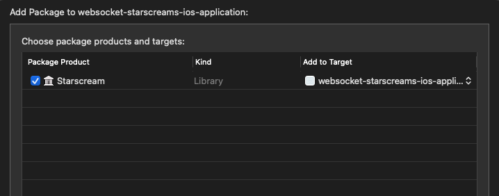
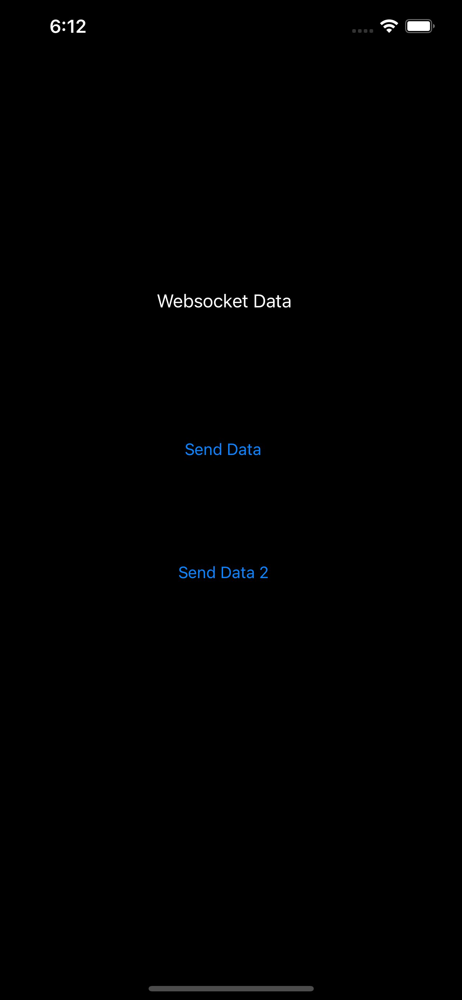

# Websocket starscreams ios application

## Description

An application that connects to a server websocket application, which we can send and receive data over Websockets using Starscream.

#### Corresponding project
https://github.com/JPrendy/websocket-client-server-javascript-application
We need the following project to be started locally to see it working live, the tests will still work, if the corresponding project is not started locally. 

## Contents

- [Setup Steps](#setup-steps)
- [How to run the project locally](#how-to-run-the-project-locally)
- [Tools](#tools)
- [Update Dependencies](#update-dependencies)
- [Releases](#releases)
- [Helpful resources](#helpful-resources)

## Setup Steps

In the project, you want to add `Starscream` by using Swift Package Manager by adding the following url https://github.com/daltoniam/Starscream, you should see something like the following

<p></p>

In the `ViewController.swift`, you want the following websocket url to be `ws://localhost:8082` as that is the port we use in https://github.com/JPrendy/websocket-client-server-javascript-application.

```swift
private var socket: WebSocket?

override func viewDidLoad() {
    var request = URLRequest(url: URL(string: "ws://localhost:8082")!)
    if ProcessInfo.processInfo.arguments.contains("TESTING") {
        request = URLRequest(url: URL(string: "http://localhost:8080")!)
    }
    
    super.viewDidLoad()
    // Do any additional setup after loading the view.
    request.timeoutInterval = 5
    socket = WebSocket(request: request)
    socket?.delegate = self
    socket?.connect()
}
```

In the `ViewController.swift`, the below code is **important** to get Websockets sending and receiving data working correctly. when we press the `sendData` button in our app we are calling `socket?.write(string: "Hi Server!")` which calls the function `didReceive` and will call the specific case `.text` and in this case whenever we `socket?.write` or another application that uses the same Websocket port of `ws://localhost:8082` uses the equivalent of `socket?.write` it updates the text of the app with `websocketData.text = string`, so we can easily see all the websocket data that is being sent and received. We can also see the data being sent and received in the logs.

```swift
@IBAction func sendData(_ sender: Any) {
    socket?.write(string: "Hi Server!")
}

@IBAction func sendData2(_ sender: Any) {
    socket?.write(string: "2nd Send Websocket data")
}

func didReceive(event: WebSocketEvent, client: WebSocket) {
    switch event {
    case .connected(let headers):
        print("websocket is connected: \(headers)")
    case .disconnected(let reason, let code):
        print("websocket is disconnected: \(reason) with code: \(code)")
    case .text(let string):
        // this is the data we receive from other users sending data to specific port we use for websockets
        print("Received text: \(string)")
        websocketData.text = string
    case .binary(let data):
        print("Received data: \(data.count)")
    case .ping(_):
        break
    case .pong(_):
        break
    case .viabilityChanged(_):
        break
    case .reconnectSuggested(_):
        break
    case .cancelled:
        print("error")
    case .error(_):
        break
    }
}
```

<p></p>

The important part of testing the websocket data we send, we need to use `Swifter` to set up a mocked Websocket server, go to `websocket_starscreams_ios_applicationUITests` and add the following

```swift
    let server = HttpServer()
    let MessagingRobot = MessagesRobot()
    
    override func setUp() {
        continueAfterFailure = false
        try! server.start()
        server["/"] = websocket(text: { session, text in
            if text.contains("Hi Server!") {
                session.writeText("Sent data via mocked Websocket")
            }
            else if text.contains("2nd Send Websocket data") {
                session.writeText("Sent data two via mocked Websocket")
            }
            else {
                session.writeText("Could not find the text we were looking for")
            }
        }, binary: { session, binary in
            session.writeBinary(binary)
        })
        app.launchArguments += ["TESTING"]
    }
```

The `app.launchArguments += ["TESTING"]` switches us to use a localhost instead of a real websocket, so when we set up the mocked Websocket server we will using `http://localhost:8080/` instead of `ws://localhost:8082/`.

```swift
    if ProcessInfo.processInfo.arguments.contains("TESTING") {
        request = URLRequest(url: URL(string: "http://localhost:8080")!)
    }
```

Whenever we send data via websockets we want look for specific strings to return mocked data, so in the app we have a button that sends `Hi Server!` via websockets and when we send that string we want to return a mocked response we would expect, in this case we are returning `session.writeText("Sent data via mocked Websocket")`.

```swift
server["/"] = websocket(text: { session, text in
    if text.contains("Hi Server!") {
        session.writeText("Sent data via mocked Websocket")
    }
    else if text.contains("2nd Send Websocket data") {
        session.writeText("Sent data two via mocked Websocket")
    }
```

An **important thing to note** when using websockets with our tests we need to use `app.restart()` for every test or any tests after the first one will fail, so we need something like the following for every test in `websocket_starscreams_ios_applicationUITests`.

```swift
func testSendingMockedWebsocketData() {
    app.restart()
    MessagingRobot
        .tapWebsocketButton()
        .assertSentWebsocketText(text: "Sent data via mocked Websocket")
}
```

To set up fastlane, type the following in the terminal and follow the steps

```
fastlane init
```

To get this working on CI, we need to add the following `gem "xcode-install"` to our `Gemfile`, as we can sometimes have issues selecting Xcode from CI. 

```ruby
source "https://rubygems.org"

gem "fastlane"
gem "xcode-install"
```

Then update our `Fastfile` to have the following

```ruby
default_platform(:ios)

  xcversion(version: "~> 12.2.0")

  platform :ios do
    desc "Runs iOS tests"
    lane :tests do
      run_tests(scheme: "websocket-starscreams-ios-application", devices: "iPhone 11")
    end
  end
```

## How to run the project locally

To run the tests locally, run the following.

```
bundle exec fastlane tests
```

## Tools

**Linter:** we use the following linter [link](https://github.com/github/super-linter).

**Uploading Artifacts:**  we use the following way to upload Artifacts, they allow you to persist data like test results after a job has completed, see the following documentation [link](https://docs.github.com/en/actions/configuring-and-managing-workflows/persisting-workflow-data-using-artifacts).

**Creating images/icons:** we use Figma to create images and icon. Figma makes it very easy to create designs in many different formats.

**Creating a Mock Server:** we use a mock server with Postman to quickly test apis, to see how to create a mock server, see the following video [link](https://www.youtube.com/watch?v=rJY8uUH2TIk). 

### Mobile Specific Tools:
 
**Fastlane:** Fastlane allows us to automate our development and release process [link](https://docs.fastlane.tools/).

**App Center:** App Center is used to distribute an app, making it very easy to test on a physical device by using a fastlane plugin [link](https://github.com/microsoft/fastlane-plugin-appcenter).

**Proxyman:** we use Proxyman to view HTTP/HTTPS requests as they happen, it is easier to debug network connections on mobile on Proxyman where we can test and mock specific network responses, see the following documentation [link](https://docs.proxyman.io/debug-devices/ios-simulator). 

## Update Dependencies

**Npm:** How to update a npm package.
- [link](https://docs.npmjs.com/cli/update).

**Gemfile:** How to update a Gemfile package.
- [link](https://bundler.io/man/bundle-update.1.html#UPDATING-A-LIST-OF-GEMS).

## Releases

How to manage releases in a repository [link](https://help.github.com/en/github/administering-a-repository/managing-releases-in-a-repository). 

## Helpful resources

The following link brings you to the `Starscream` repo which we use for Websocket connections on iOS.
- [link](https://github.com/daltoniam/Starscream).

The following link is a good tutorial on how use Websockets on iOS with Starscream 
- [link](https://www.raywenderlich.com/861-websockets-on-ios-with-starscream).